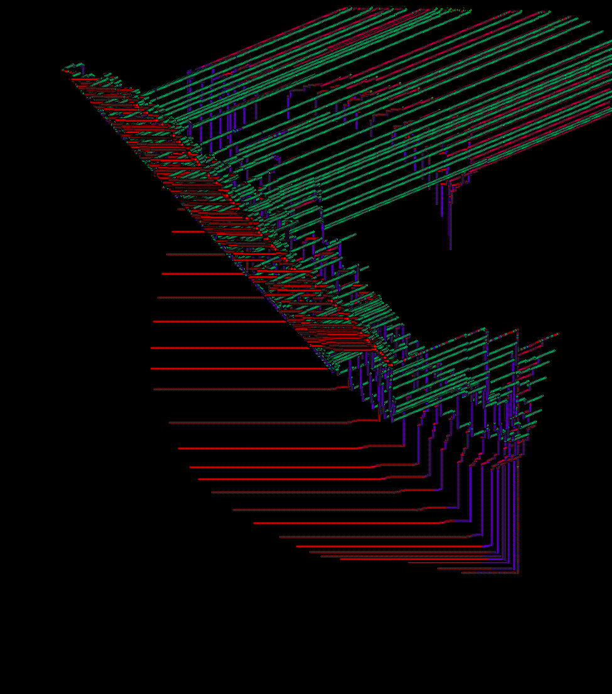

# Neural Network
### Summary
This program uses a simple feed-forward ANN with mini-batch gradient descent to generate a vector field, where each vector is predicted based of an $(x, y)$ input. The NN is trained on a randomly generated vector field where in data points are $(x, y)$ pairs, and the labels are 1 of `NUM_OF_DIRECTIONS` which denotes the approximate direction the vector is pointing. 
As the program runs, in each frame we are training the neural net over the course of `EPOCHS` many epochs, with a new mini-batch each time. After finishing that round of training, we feed the neural net a grid of points and use its output layer to create a "predicted vector field", which gets displayed. 
Below you will see the vector field the nerual net was training on and a single frame of the ever evolving predicated vector field. In the upper left corner there is a running display of the current cost function. 
### Training Field
 
### Predicated Field

In addition to watching the predicted vector field, there is another mode in the program in which the user can drag their mouse and each point that is created gets fed into the neural net and moved based on the output of the training neural net. Below is an image of a few lines drawn and the result of letting the points flow through the predicted vector field:

