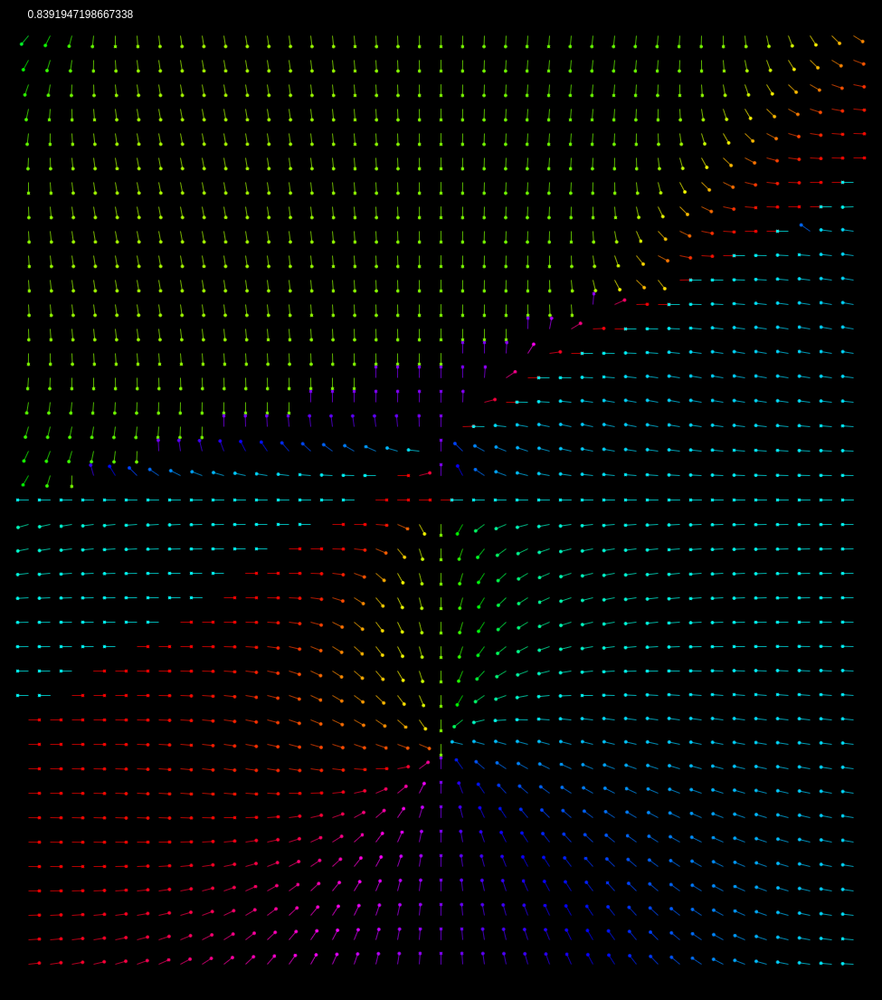
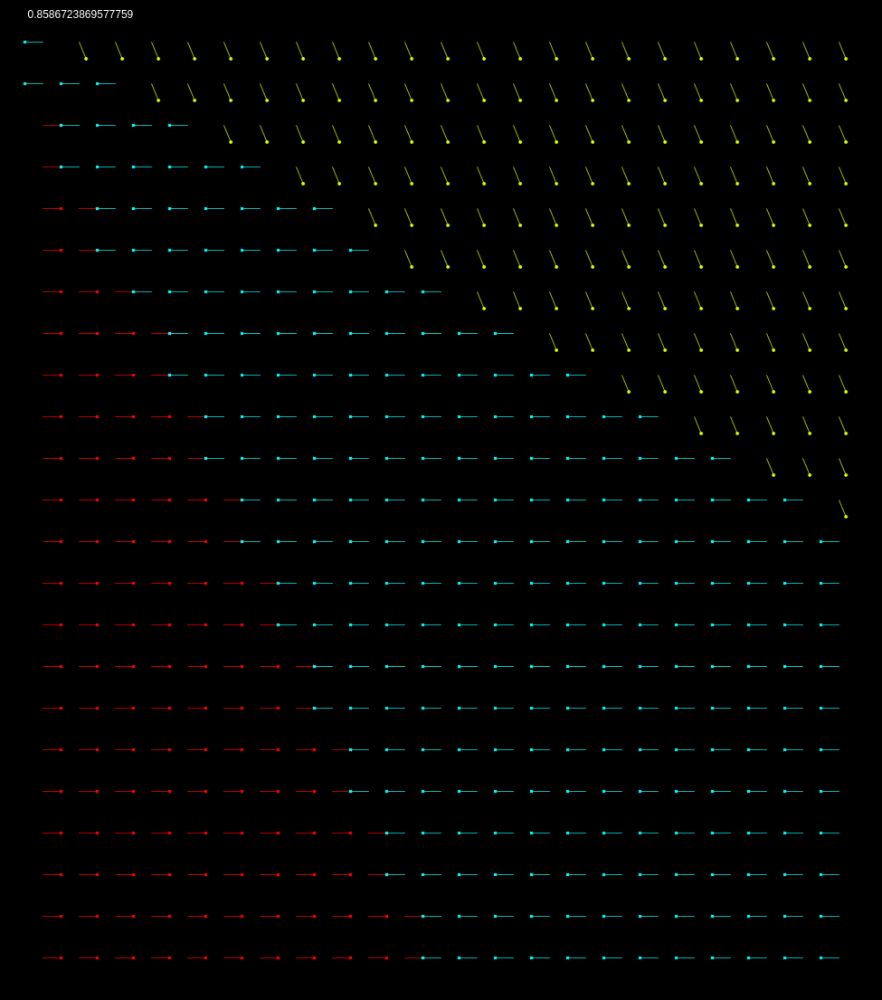

# Neural Network
### Summary
This program uses a simple feed-forward ANN with mini-batch gradient descent to generate a vector field, where each vector is predicted based of an $(x, y)$ input. The NN is trained on a randomly generated vector field where in data points are $(x, y)$ pairs, and the labels are 1 of `NUM_OF_DIRECTIONS` which denotes the approximate direction the vector is pointing. 
As the program runs, in each frame we are training the neural net over the course of `EPOCHS` many epochs, with a new mini-batch each time. After finishing that round of training, we feed the neural net a grid of points and use its output layer to create a "predicted vector field", which gets displayed. 
Below you will see the vector field the nerual net was training on and a single frame of the ever evolving predicated vector field:
 
